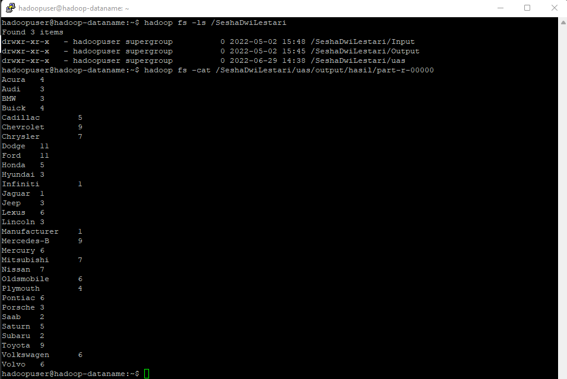

# Hadoop UAS Big Data MAP - REDUCE (Data Penjualan Mobil)
---------------------------------------
> Dosen Pengampu  
> Dian Hanifudin Subhi, S.Kom., M.Kom.
---------------------------------------
--------------------------
> Sesha Dwi Lestari  
> 1941720062 / 19  
> TI - 3A   
--------------------------
### Studi Kasus
Data didapatkan dari kaggle dengan nama Car sales, data tersebut terdiri dari :
- Manufacture
- Model
- Sales_in_thousands
- Year_resale_value
- Vehicle_type
- Price_in_thousands
- Engine_size
- Horsepower
- Wheelbase
- Width

Dari data tersebut, akan dilakukan perhitungan banyaknya Manufacture dari mobil yang telah terjual menggunakan hadoop.

### File .csv
https://drive.google.com/file/d/1plJhULE7oPpg-zrA29AndKdwN6c-_oS2/view?usp=sharing

### Hasil Mapreduce Hadoop

### Link Video Youtube
https://youtu.be/F7wznrX4yUU
